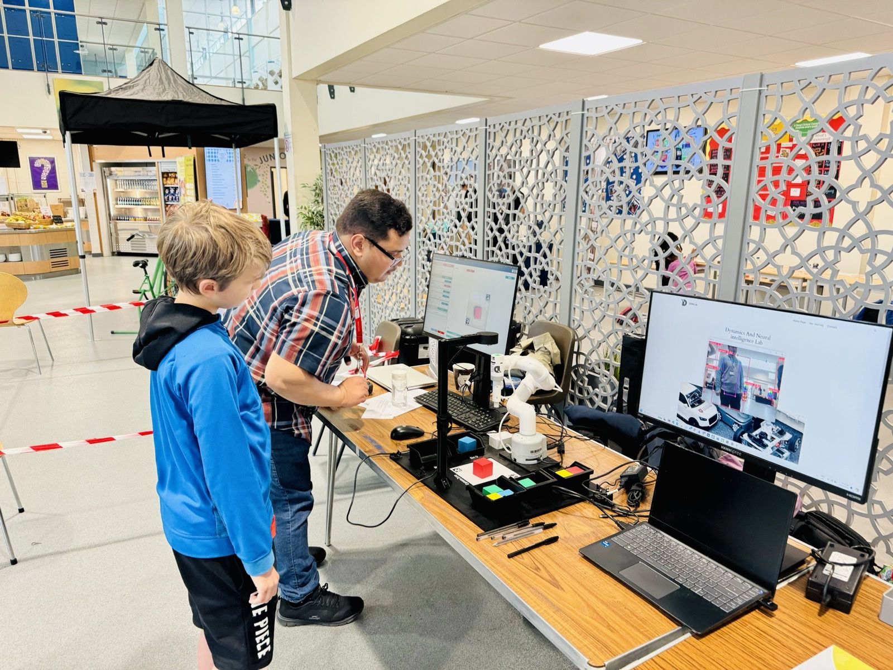
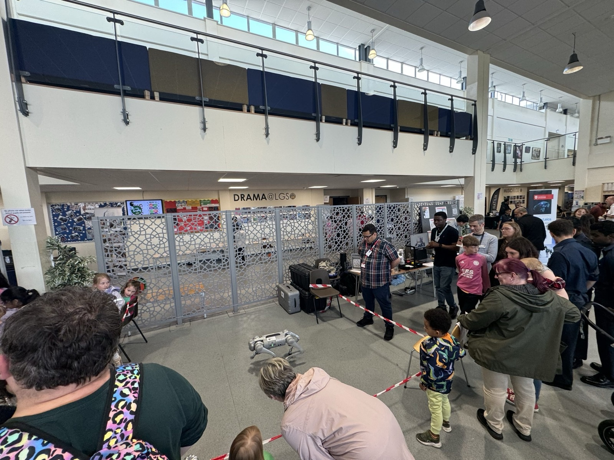
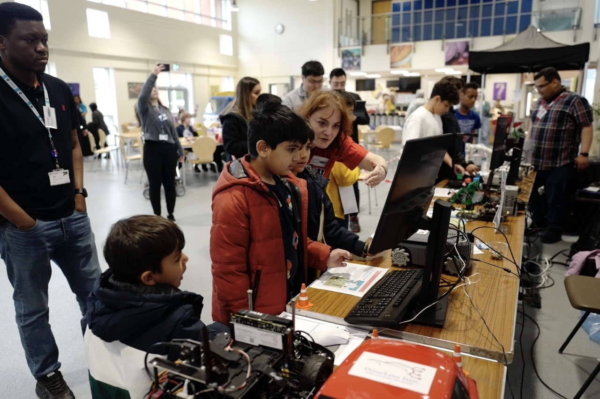

We had the opportunity to walk through an exciting future of robots and artificial intelligence as we attended the largest school-based STEM Fair, Bright Sparks, at Leicester Grammar School with Team DriverLeics and their robot dog.

Leicester Grammar School hosted the Bright Sparks STEM Fair 2024 on 15 June, recognized as the largest school-based STEM Fair in the country, which usually draws thousands of visitors from throughout the county and beyond. The fair was a vibrant hub of scientific exploration, featuring over 70 exhibitors from local businesses, universities, and STEM organisations.

As invited exhibitors, we joined the DriverLeics team, comprised of academics from the University of Leicester College of Science and Engineering.

Learn more on the [University of Leicester news page](https://le.ac.uk/news/2024/june/bright-sparks-2024).
