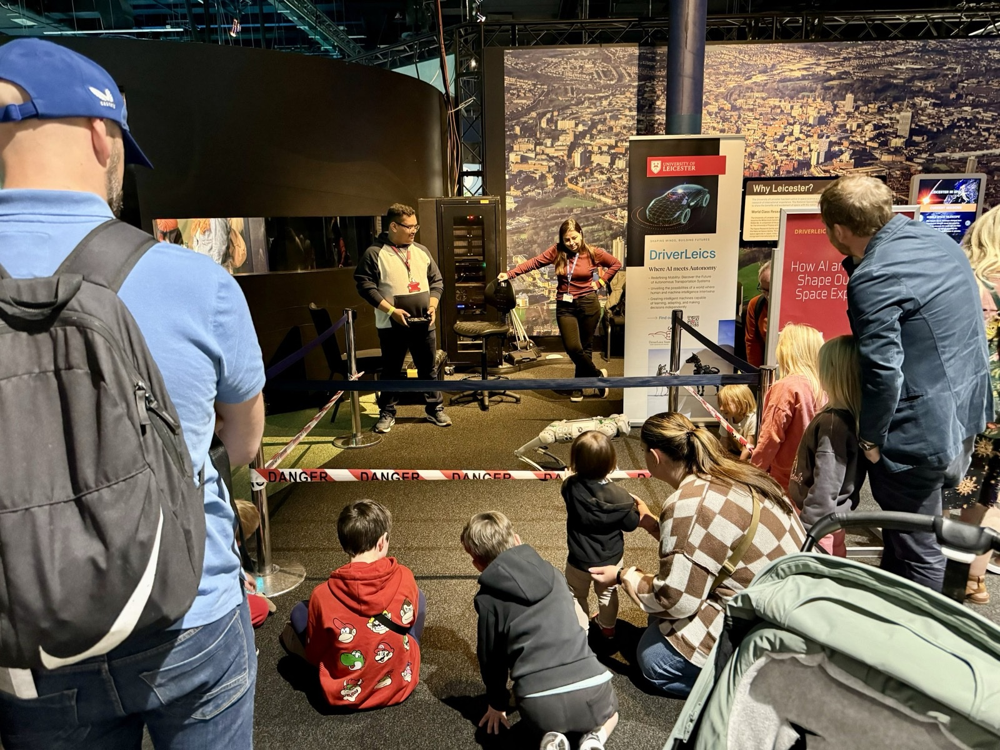
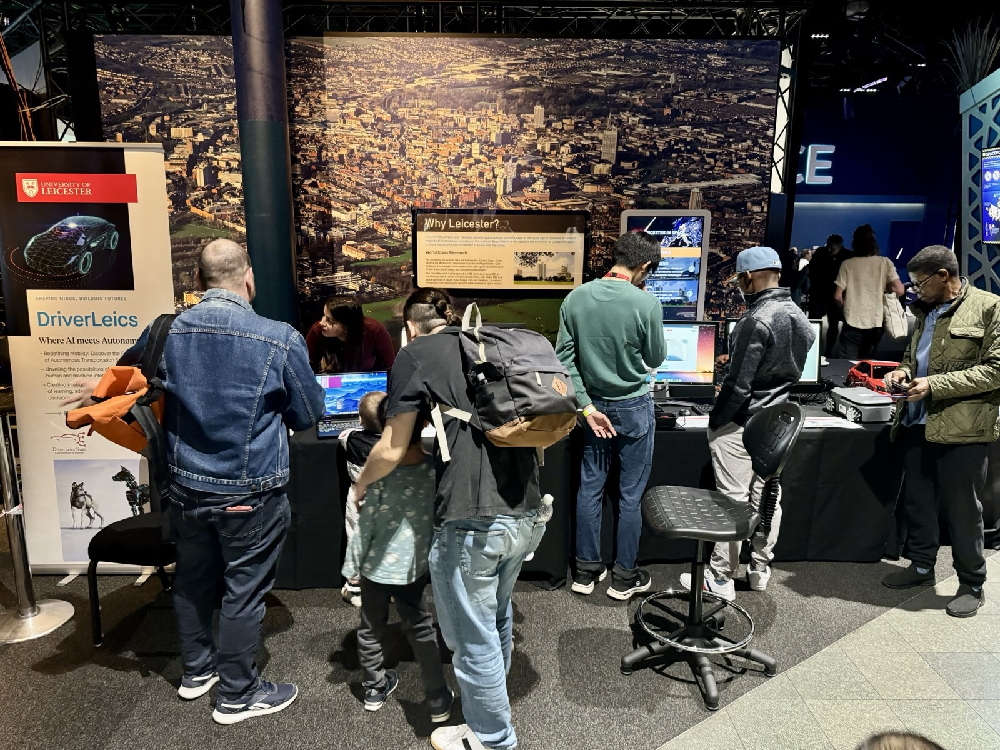

Read more on the [University of Leicester news page](https://le.ac.uk/news/2024/september/space-festival).

The technology behind self-driving cars is playing a key role in future space missions, according to a team of scientists who have been demonstrating the importance of AI and robotics in space exploration.

The University of Leicester's DriverLeics Team from the [School of Computing and Mathematical Sciences](https://le.ac.uk/computing-and-mathematical-sciences) proudly represented the institution at the UK in Space Festival held at the National Space Centre. The event, which featured major UK space industry leaders such as Airbus and Astroscale, celebrated the nation's achievements and advancements in space exploration.

Led by Dr Daniel Z. Hao and accompanied by Dr Neslihan Suzen, the team included Computer Science students Abdulqader A.M. Dhafer and Ansel M.J. Ong. They showcased the University's cutting-edge research in computer science and its significant contributions to UK space education and research.

Dr Hao said: "We are privileged to be invited to such an important event to celebrate the UK's presence in space. It's an excellent opportunity to explain to the general public and families how self-driving cars are relevant to Mars Rovers, and how we are planning to deploy AI and robotic dogs for space exploration."

The DriverLeics Team demonstrated how advancements in autonomous vehicle technology can be applied to space missions. By drawing parallels between self-driving cars and Mars Rovers, they highlighted the role of artificial intelligence and robotics in navigating and exploring extraterrestrial terrains.

Their demonstration includes showing a robotic dog, emphasizing the potential of these technologies to enhance mission capabilities and safety for future space exploration. The initiative underscores the University of Leicester's commitment to innovation and excellence in the field of computer science.

Dr Neslihan Suzen added: "Engaging with the public at events like the UK in Space Festival allows us to inspire the next generation of scientists and engineers. It's a fantastic platform to showcase how our school’s research contributes to the broader space exploration efforts of the UK."

Credit: University of Leicester
