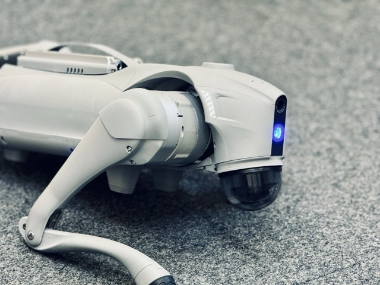
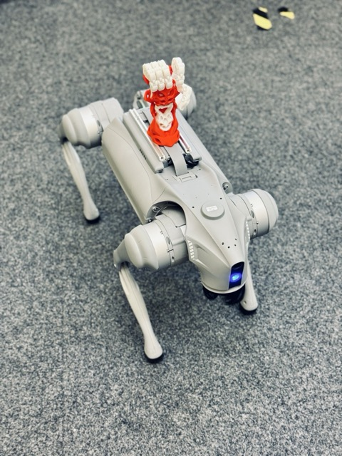
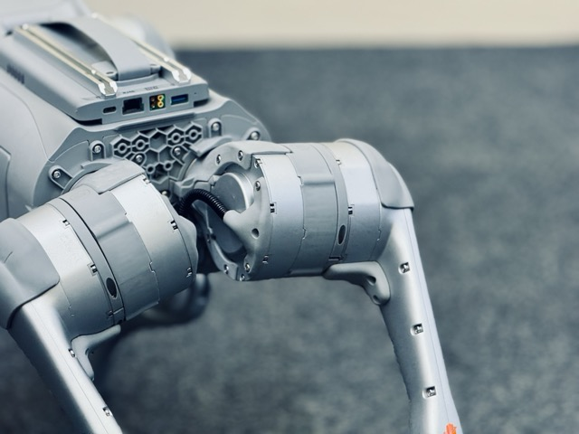
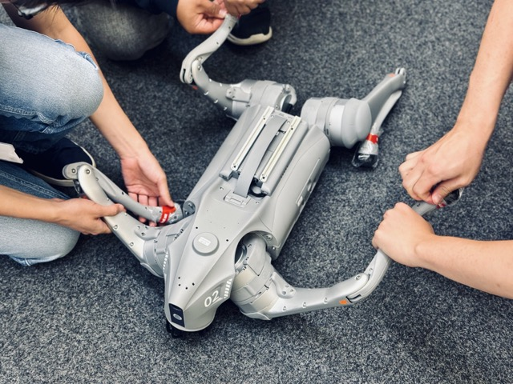

🐾 **Say hello to our newest lab member!** 🐾

We’re thrilled to welcome the **Unitree GO2-EDU quadruped robot** — or as we like to call it, our new robotic dog 🐕🤖.

The GO2 brings incredible agility, smart sensors, and a lot of personality into the lab. It’s going to help us explore new frontiers in robotics, AI, and human–robot interaction. From testing advanced navigation to experimenting with autonomous behaviours, this little powerhouse is ready for some big adventures.

We can’t wait to share updates, demos, and maybe even a few fun tricks as our robotic pup settles in. Stay tuned — the journey’s just beginning! 🚀
