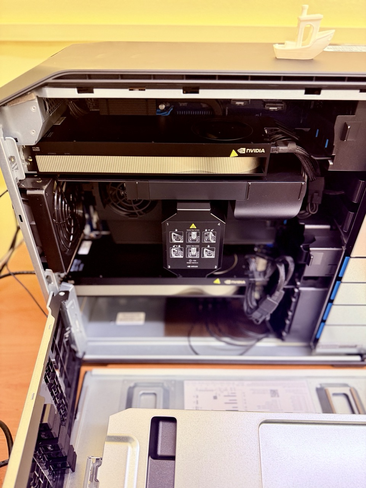

Team finally welcomed our AI workstation, powered by dual RTX Pro 6000 Blackwell ([https://www.nvidia.com/en-gb/products/workstations/professional-desktop-gpus/rtx-pro-6000/](https://www.nvidia.com/en-gb/products/workstations/professional-desktop-gpus/rtx-pro-6000/)) GPUs, giving us roughly 200 GB of combined VRAM for our Vision–Language Model (VLM) and World-Model research.

