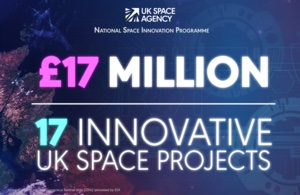

See news at:

[https://www.gov.uk/government/news/uk-space-agency-invests-17-million-to-drive-next-wave-of-space-innovation](https://www.gov.uk/government/news/uk-space-agency-invests-17-million-to-drive-next-wave-of-space-innovation)

[https://www.gov.uk/government/news/scottish-space-innovation-secures-uk-space-agency-investment](https://www.gov.uk/government/news/scottish-space-innovation-secures-uk-space-agency-investment)

University and SPL news:

[https://www.space-park.co.uk/2025/12/new-funding-to-develop-technology-for-first-robots-to-weld-in-space/](https://www.space-park.co.uk/2025/12/new-funding-to-develop-technology-for-first-robots-to-weld-in-space/)

[https://le.ac.uk/news/2025/december/funding-technology-first-robots-weld-space](https://le.ac.uk/news/2025/december/funding-technology-first-robots-weld-space)
