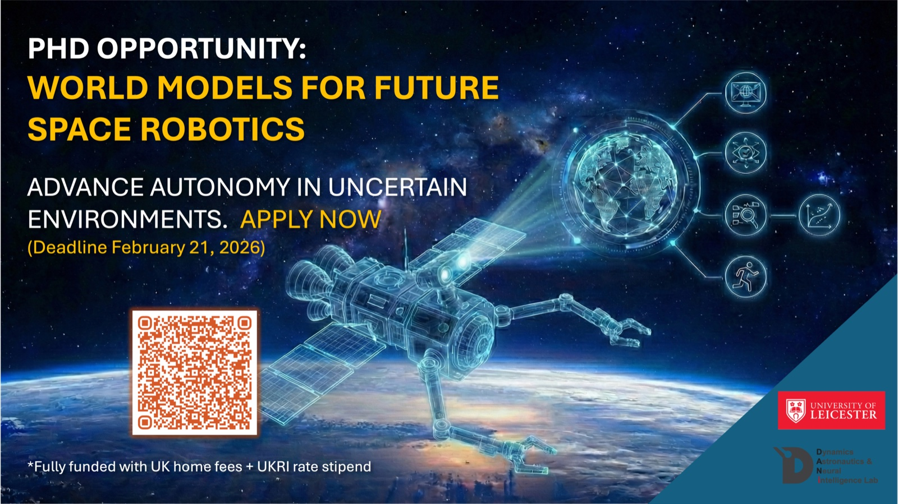

## Project Highlights

Develop next-generation embodied AI methods, including world models, uncertainty-aware learning, and safe decision-making, for long-horizon robotic autonomy under extreme uncertainty.

Combine theory with hands-on experimentation through validation on real robotic platforms (e.g., robotic arms) performing contact-rich inspection, repair, assembly, and servicing tasks in simulation, laboratory or space-analogue environments.

Enable trustworthy and certifiable autonomous robotics for future space infrastructure, with broader impact across aerospace, nuclear, offshore, and other safety-critical domains.

## Project Summary

Robotics is recognised as a key enabler for future in-space servicing, inspection, and assembly, yet current systems remain largely dependent on teleoperation, scripted behaviours, or short-horizon control. Learning-based methods improve flexibility but often fail to generalise, lack predictive reasoning about contact dynamics, and provide limited safety guarantees, challenges that are exacerbated in extreme environments with degraded sensing, altered physics, and high failure costs.

This PhD will develop world-model-based and uncertainty-aware approaches for embodied intelligence, enabling robots to predict, plan, and adapt under severe uncertainty. The research focuses on learning predictive world models of environment and contact dynamics to support simulation-driven planning, risk-sensitive control, and online adaptation for improved robustness and safety.

All methods will be validated experimentally on physical robotic platforms performing contact-rich servicing tasks in laboratory and space-analogue environments, ensuring real-world performance beyond simulation.

### The student will

- develop world-model-based and learning-based algorithms for perception, prediction, planning, and control
- implement and evaluate methods on real robotic hardware and simulators
- design rigorous experiments and quantitative benchmarks
- publish in leading AI and robotics venues
- contribute to open-source and collaborative research projects

The project will deliver fundamental advances in embodied intelligence and practical autonomy technologies for ISAM and other safety-critical applications.

## Required Skills and Qualifications

- First-class or high 2:1 degree (or international equivalent), ideally with a Master’s, in Robotics, Computer Science, Aerospace, Electrical Engineering, or a closely related discipline
- Strong foundations in robotics and control (kinematics, dynamics, state estimation, feedback control)
- Experience with robotic simulation and experimentation (e.g., ROS/ROS2, Gazebo/Mujoco, or HIL systems)
- Proficiency in Python and/or C++ for algorithm development and system integration

### Desirable

- Knowledge of machine learning methods for robotics (e.g., reinforcement or model-based learning) and ability to conduct experimental evaluation
- Background in space robotics, GNC, or safety-critical systems
- Prior research outputs (e.g., publications)

Applicants are strongly encouraged to contact the supervisors of the GTA projects to discuss their suitability and eligibility before they apply.

## Apply

Find the [project listing on FindAPhD](https://www.findaphd.com/phds/project/gta-funded-world-model-based-intelligent-robotics-for-in-space-servicing-assembly-and-manufacturing-isam/?p194201).

Apply on the [University of Leicester Computer Science GTA page](https://le.ac.uk/study/research-degrees/funded-opportunities/computer-science-gta).
