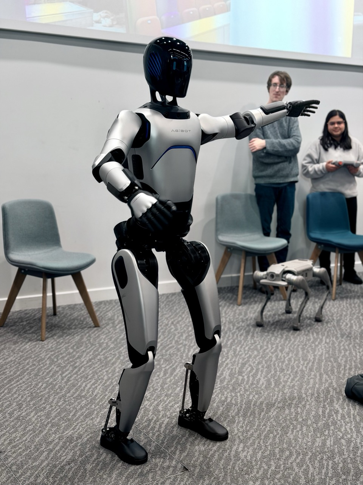

We recently welcomed visitors from Agibot to the University of Leicester.

During the visit, Agibot brought several robots and demonstrated their capabilities to researchers and students. The team also had the opportunity to explore our robotics platforms in the lab, including robotic arms, quadruped robots, and aerial systems.

It was a pleasure to host the team and share our research environment. We look forward to staying in touch and exploring opportunities for future engagement.

