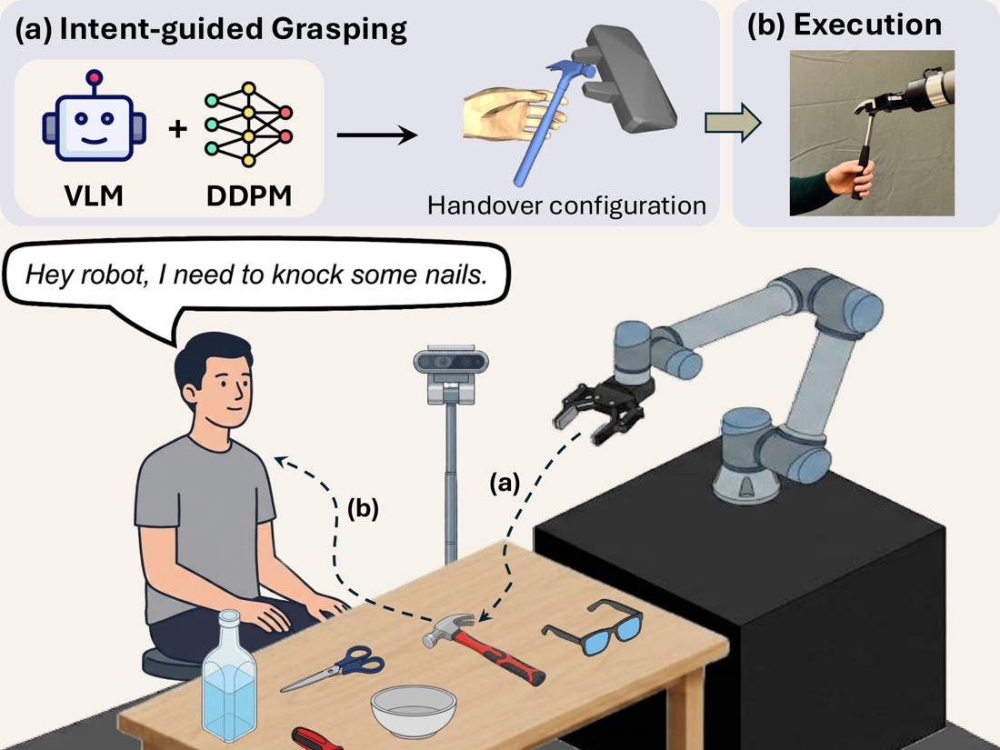
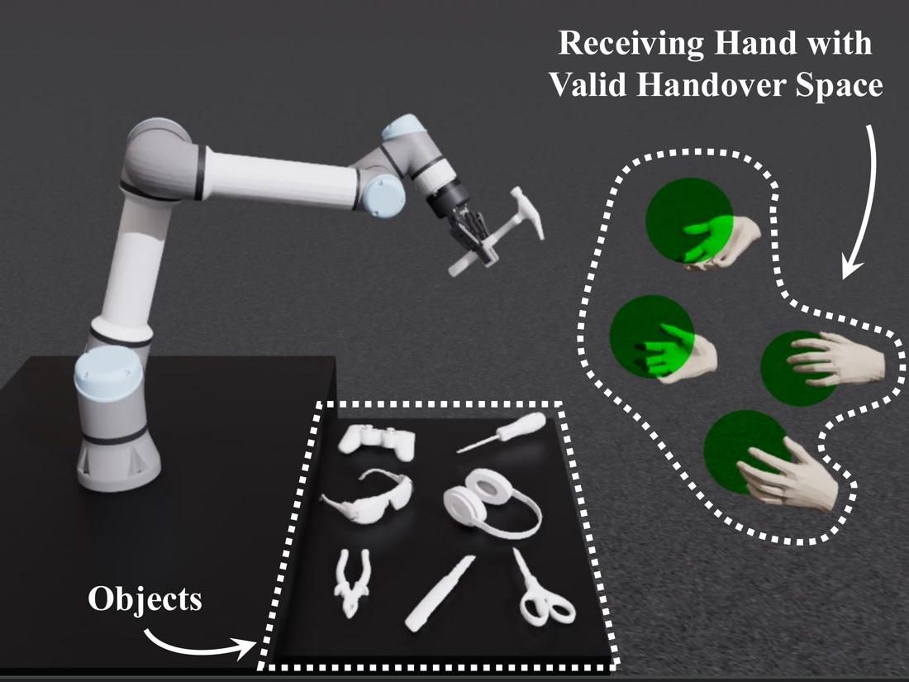

We are delighted to share that two of our papers have been accepted at [IEEE/RSJ IROS 2026](https://2026.ieee-iros.org/), which takes place in Pittsburgh from 27 September to 1 October. Both tackle a deceptively simple question: how should a robot hand an object to a person? Picking up the right object is only half the job. Where the robot holds it, and how it presents it, decides whether the person can take it safely and use it straight away, and whether they trust the robot enough to reach for it at all.

### Intent-Handover: Grounding Language in Human-Usage Regions for Trustworthy Robot-to-Human Handovers

Say *"I need to knock some nails"* and the robot should pass you a hammer, handle first. Intent-Handover uses a vision-language model to infer what the person wants from speech and camera input. A diffusion model then generates a grasp that keeps clear of the parts the person will need to hold or use. During execution, the robot lines the object up with the person's receiving hand and avoids hand-gripper collisions.

- Intent is correctly identified in **88%** of trials.
- Being aware of human-usage regions significantly improves how **competent and reliable** people find the robot, and collision avoidance mainly improves **perceived safety**.
- The full system beats its ablations on **trust, safety and comfort**.

**Links:** [Project page](https://robot-future.github.io/intent-handover/) · [Paper (PDF)](https://hanxin-zhang.github.io/images/papers/intent-handover/intent-handover-grounding-language-in-human-usage-regions-for-trustworthy-robot-to-human-handovers.pdf) · Code coming soon

### R2HandoverSim: A Simulation Framework and Benchmark for Robot-to-Human Object Handovers

There has been no standard way to compare robot-to-human handover methods, so progress has been hard to measure. R2HandoverSim is a reproducible simulation benchmark built around a UR5e arm and 16 everyday objects. It has two evaluation splits, one for unconstrained objects and one for functionally constrained objects. Each handover is scored on five metrics: plan feasibility, reach accuracy, stability, affordance and safety.

- We validated the benchmark with **600 real-world trials** involving **30 participants**.
- Intent-Handover achieved a **73.3%** real-world success rate, compared with 63.3% for Contact-Handover.
- A key finding: **a higher success rate in simulation does not guarantee a better experience for users**. Affordance, meaning whether the person can actually use what they are handed, is critical to how good a handover feels.

**Links:** [Project page](https://robot-future.github.io/r2handoversim/) · [Paper (PDF)](https://hanxin-zhang.github.io/images/papers/r2handoversim/r2handoversim-a-simulation-framework-and-benchmark-for-robot-to-human-object-handovers.pdf) · Code coming soon

Many congratulations to my PhD students [Hanxin Zhang](https://hanxin-zhang.github.io/), who led both papers, and [Abdulqader Dhafer](https://adhafer.github.io/), and to our co-author [Hongbiao Dong](https://www.birmingham.ac.uk/staff/profiles/metallurgy/dong-hongbiao). Thank you also to the reviewers for their constructive feedback and to everyone who took part in our user studies.
